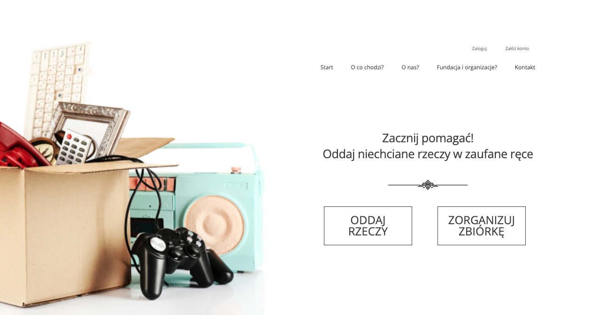
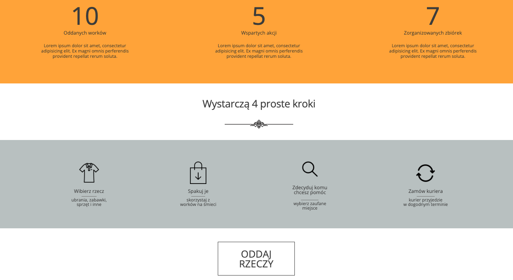
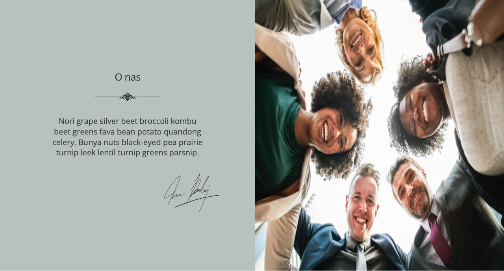
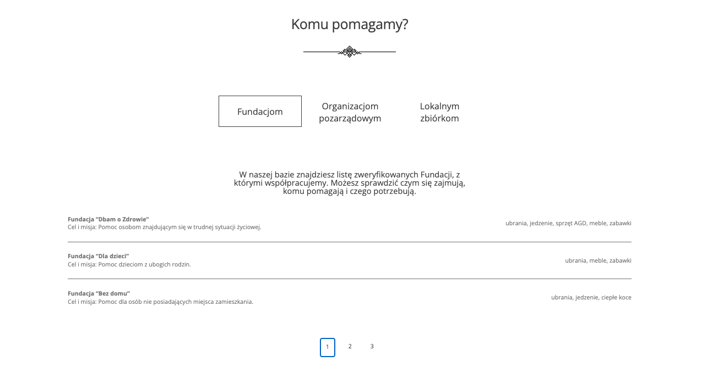
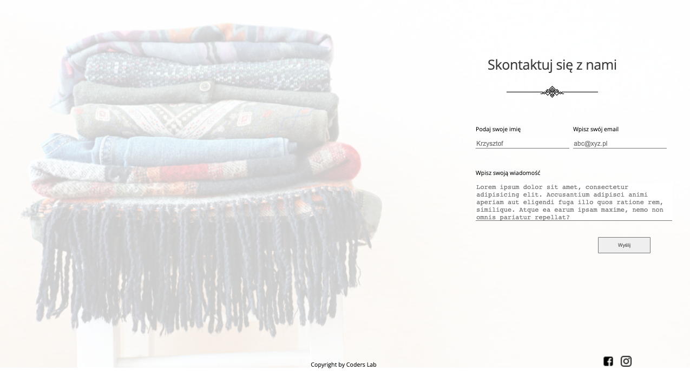
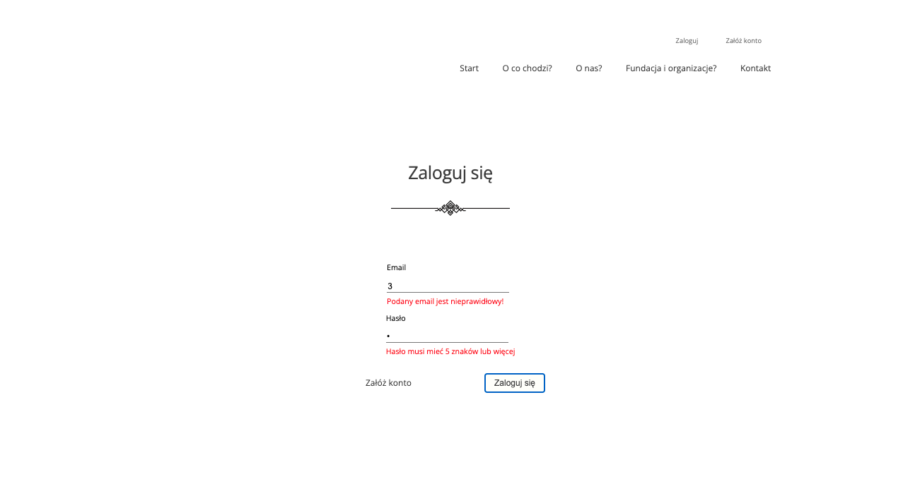
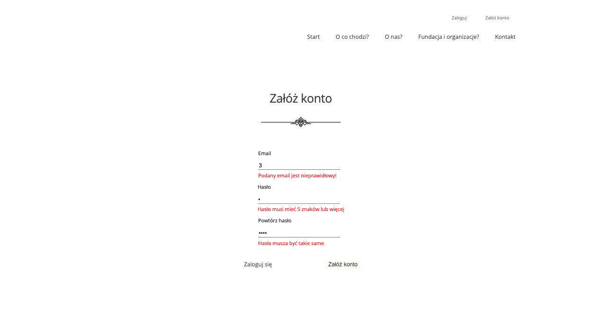
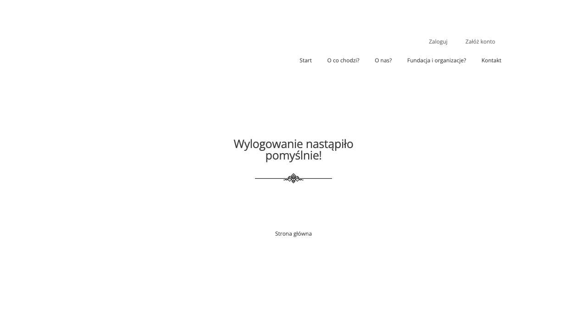

Giveaway website

!!! In progress - but take a peek, it looks not bad already !!!

Te main purpose of the project is creacting a virtual place where everyone can give away unnecessary things to trusted
institutions.

Project is a website, with simple form which will make it easier for user to give things away.

## Table of Contents

* [General Info](#general-information)
* [Technologies Used](#technologies-used)
* [Screenshots](#screenshots)
* [Setup](#setup)
* [Project Status](#project-status)
* [Room for Improvement](#room-for-improvement)
* [Contact](#contact)

## General Information

- Project created as additional project to Coders Lab bootcamp on basis of [_
  mockup_](https://xd.adobe.com/spec/f11fc670-7af2-4502-4013-c1f66f8d3332-872e/grid/).
- Magda (UX designer) has done quite a bit of research of which she created mockup project; the basis for this website.
- Website is in Polish

## Technologies Used

- React
- React Router
- React Scroll
- React Context
- React Tabs
- React Paginate
- HTML
- SCSS
- JavaScript

## Screenshots

## Setup

- download or clone repository / `git clone repo_address`
- install dependencies / `npm install`
- start app by `npm start`

## Project Status

Project is: _in progress_.

[//]: # (Assumed learning task completed.)

## Room for Improvement

- Mobile version
- LogIn / LogOut features
- form assisting ordering delivery of given goods
- database connection

## Contact

Created by [_Duckjaniels_](https://www.linkedin.com/in/maksym-kaczorowski-008b3a154/) - feel free to contact me!